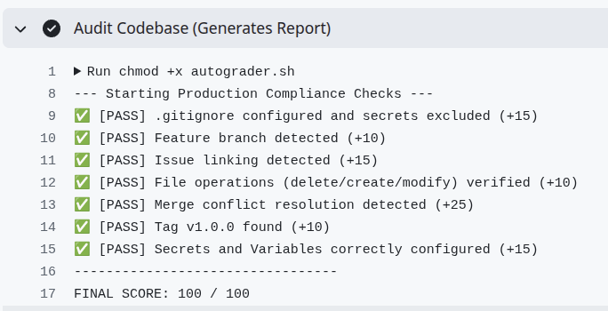

# Assignment 3: Using git and github in a production environment

Working in a production software environment requires the use of practices and conventions to ensure code changes 
maintain a stable and tested  `main` code branch in a repository.  This assignment provides some of
the more common practices that you'll see.  


## Scenario: Your first sprint
It is your first day with the DevOps team at **Shyfty.ai**. Your manager has assigned you a ticket to
configure the CI/CD pipeline  with a set of tasks to clean up the legacy repository and configure
the repository for a Production Environment.  After assigning you these tasks, the manager and the
team take a long lunch at the local Byte Bites Cafe, and leave you to make these changes on your own.

You want to impress the team with the skills and knowledge you acquired in the CSYE 6225 class. You
set out to complete the assigned tasks. 

### Objective
Demonstrate a production-ready Git workflow including atomic commits, repository branching, and conflict
resolution (merge).

### Deliverables 
* A clean Git history with atomic commits.
* A functioning GitHub Actions pipeline.
* A resolved merge conflict.
* A released version tag (`v1.0.0`)
* Demonstrate that all Acceptance Tests have passed.


### Task 1: Environment Hardening
1. **Clone & Inspect:** 

   After you accept the classroom assignment, clone the assignment repository to your local machine. Use the `https://`
   of your github repository.  This is your local git repository: 

   ```bash
   git clone https://github.com/neu-csye6225-sea/assignment-3-<github user>.git
   git status
   ```
   The status output should display your current branch (`main`) and the local repository is up to
   date with the remote repository. 

2. **Security Configuration (Secrets):**

   You need to first setup your repository configuration with the proper secrets and variables so
   the CI/CD pipeline (Github Actions) can run correctly.  Repository Secrets are available to
   github actions scripts, and by exporting the secret in the github action workflow, they can be
   made available to your programs.  You can see this export in action in the `classroom.yml` file.  

   Secrets and Varibles are similar ; The main difference is that the contents of secrets are never
   exposed in workflow output.  Variables can be printed in log output. 

   * Go to your repo settings on GitHub: `Settings > Secrets and variables > Actions`.
   * Add a **Repository Secret** named `API_KEY`. Value: `sk_live_123456`.
   * Add a **Repository Variable** named `DEPLOY_ENV`. Value: `production`.

3. **Adding a  .gitignore file**

   You notice that the repository doesn't have a `.gitignore` file. This file is used to block 
   (ignore) files with a specific name from being committed to the repository.  This prevents both 
   temporary files (like log or IDE files) from being included in the directory, and more
   importantly, from including passwords or keys from being included. 

   * Create a `.gitignore` file in the  root directory.
   * In production, leaking logs or env files is a security incident. Ensure your `.gitignore`
   includes blocking the files:

   ```bash
   # .gitignore file
   passwords.txt
   .env
   envrc
   *.log
   .vs
   .vscode
   .DS_Store
   Thumbs.db
   Desktop.ini
   .idea
   ```
   * **Add and Commit the file to the local repo** 

     ```bash
     git add .gitignore 
     git commit -m "config: add gitignore"
     ```

### Task 2: Feature Development (Atomic Commits)

You will now perform the core development work required by your ticket.  You must use **Atomic
Commits** (one commit per logical change) in applying these changes, and maintain the ability to
track these changes through the use of a tracking ticket.  This allows you (and other team members)
to track, review and audit changes throughout the life of a repository, and become part of the
permanent record of a repository.  This task has three separate commits (each with a log message) to 
clearly identify the individual changes.  In the final task commit, we have a github meta-command to
link these three commits to a single repository issue (Ticket) for tracking and audit purposes. 

1. **Create the Ticket:**

Create a ticket that you will use to track your three feature changes. You can use a single ticket to
manage multiple commits.  The ticket represents a group of related changes. 

   * Go to the **Issues** tab in your repository.
   * Create a new Issue titled: `Refactor Repo and Pipeline`.
   * Note your Issue ID Number that was created (most likely #1 or #2).

2. **Create the Feature Branch:**

   An important practice is not directly work on the `main` of your code. Create a new 
   branch to work on your changes, and after you have confirmed and tested the changes are correct, then merge them into `main`. 

   To start, create your working branch for your changes: 

   ```bash
   git checkout -b feature/pipeline-setup
   ```
3. **Refactoring Operations on your branch**

   A common repository task to making a number of changes in a repository for the purpose of
   restructuring or reorganizing code is known as "refactoring". 

   Perform the following three changes on your code branch, performing a commit (with a commit message)
   for each change.  This is known as an "atomic commit", where each logical change can be applied or
   removed (known as a *reversion* or *backout*).

   * **Step A: Remove Legacy Code**
     * Delete the file `obsolete.txt`.
     * Commit this change immediately.

     ```bash
     git rm obsolete.txt
     git commit -m "chore: remove legacy file"
     ```

   * **Step B: Add Documentation**
     * Create a new file named `CONTRIBUTING.md`.
     * Add the text: `Please fork this repository and submit a Pull Request for any changes.`
     * Commit this change immediately.

     ```bash
     git add CONTRIBUTING.md
     git commit -m "docs: add contributing guidelines"
     ```
   * **Step C: Update Environment Config**
     * Edit the file `ENV.md`.
     * Change `Current Environment: DEV` to `Current Environment: PROD`.
     * **Commit & Link:** Commit this change and reference your Issue ID to close it. (Replace `#X` with your actual ID).

     ```bash
     git add ENV.md
     git commit -m "feature: update env to PROD (closes: #X)"
     ```

     The final commit includes the string `closes: #X`.  Github will recognize this string and will
     automatically link the changes to the ticket (issue).  You can only close a ticket once.

   * **View Commit Log**:
     Use `git log` to list your recent commits. The `--oneline` flag provides a compact view, which is useful for checking your commit messages.
     To see exactly what changed in a specific commit, use `git show <commit hash>` (the alphanumeric
     string on the left of the log).  

     ```bash
     git log 
     git log --oneline
     git show <commit hash>
     ```
     Example: `git show a1b2c3d4` will display the file differences (diffs) for that specific commit.

4. **Push Changes:**

   Push your feature branch and commits to GitHub.  The push is required to alert Github and
   update the ticket.  Note that the ticket will still be open after the "push", as you are working
   on branch rather than on `main`.  The ticket (issue) will be automatically closed in later steps
   when you merge your changes to the `main` branch. 

   ```bash
   git push -u origin feature/pipeline-setup
   ```

### Task 3: Dealing with a Merge Conflict

In a collaborative team, updates happen on the central repository while you work on your local branch. You must frequently sync your work with these external changes.

Sometimes, another developer may commit a change that conflicts with your work (for example, modifying the same line in a shared file). This results in a "merge conflict" that Git cannot resolve automatically. You must resolve it manually.

In this task, you will apply another developer's fork and changes to your repository.  This will
create some conflicts that you will need to resolve.  

1. **Configure Remote Upstream:**

   Add another repository as a remote called `upstream`.  This is another developer's repository
   fork that has conflicting changes.  

   ```bash
   git remote add upstream https://github.com/neu-csye6225-sea/202601-assignment-03-template.git
   ```

2. **Fetch & Merge:**

   Retrieve the conflicting branch from the upstream repo and attempt to merge it into your current
   feature branch.  Note the use of the special flag due to the repo history differing from yours. 

   ```bash
   git fetch upstream update/team-rules
   git merge upstream/update/team-rules --allow-unrelated-histories
   ```
3. **Resolve Conflicts:**

   * **Fix ENV.md**: Open `ENV.md`. You will see conflict markers ( `<<<<<<<`, `>>>>>>>` and `========`) separating your change (PROD) and the upstream change (STAGING).
     * **Action:** Edit the file to remove the markers and keep BOTH changes.
   * **Fix obsolete.txt**:  The merge may have restored the file `obsolete.txt` that you removed
   earlier because the upstream branch still container it. 
     * **Action:** Force delete the file again. 
       ```bash
       git rm obsolete.txt -f
       ```
   * **Add, Commit and Push**: Once the conflicts are resolved, finalize the merge commit and push it to
   Github.

     ```bash
     git add ENV.md
     git commit -m "merge: refactoring to PROD env"
     git push
     ```

### Task 4: Release Engineering 

Now that your feature work is complete, you will merge it into the main codebase and cut a
production release.  The is done by applying your changes in your feature branch back into the
`main` branch. 

1. **Create and Push a Release Tag**
   
   * Create a version tag for the release to mark this specific commit as a production release.

     ```bash
     git tag v1.0.0
     ```
   * **Push the tag**
     Tags are not automatically pushed with standard commits. You must push them explicitly. 

     ```bash
      git push origin v1.0.0
      ```
2. **Create and Merge a Pull Request (GH Web Interface):**
   * Navigate to your repo on Github.
   * Ignore the prompt to `Compare & pull request` for your `feature/pipeline-setup` branch.  While
   this will create a pull request, the default will use the `main` branch from the upstream
   repository, which means the upstream repo would be updated.  What you want in this case is for
   your `main` repo to be updated.  Therefore, we'll need to create the pull request manually. 
   * Go to the "Pull requests" tab and click "New pull request".
   * **Settings**: 
     * **Base**: `main`  (for your repository)
     * **Compare**: `feature/pipeline-setup`
   * Click "Create pull request"
   * **Review**: Scroll down to the bottom. You may see a message saying "All checks have failed".  **This is expected** 
   at this stage as we haven't tagged the release yet.  You can safely ignore this. 
   * Click "Merge pull request", then "Confirm merge".  
   * Ensure the status updates to "Pull request successfully merged and closed".  This is the key
   step to confirming the merge request was created properly.  Your remote repository on github is now
   updated, but you need to take one more step to update your local repository. 
3. **Sync Local Repository:**
   * Switch back to your terminal to update your local `main` branch with the code you just merged
   on Github. 

     ```bash
     git checkout main
     git pull origin main
     ```
4. **Final Verification:**
   * Go to the **Actions** tab in your Github Repository. It may take a minute for the latest
   workflow to start running. 
   * You should see a workflow run triggered by your tag push (you'll see `v1.0.0` in the workflow
   branch field). It should look like:

     ```bash
     Merge pull request #2 from neu-csye6225-sea/feature/pipeline-setup     v1.0.0
     ```
   * You can click on the workflow run title to see the logs. 
   * **Success**: The workflow should display a green checkmark.
     * 
   * **Fail**: The workflow will show a red checkmark.  Audit the Github Action logs for more
   information on what went wrong.  
   * **Audit**: Click on the workflow run and select "Audit Codebase (Generates
   Report) to see the grading report logs. 

### Assignment Requirements Summary

Students are required to simulate a "Day 1" DevOps scenario involving environment hardening, feature development, and release engineering.

**1. Environment Hardening & Security**

* **Secrets Management:** Configure GitHub Repository Secrets and Variables with exact values to pass the pipeline validation:
* Secret `API_KEY`: `sk_live_123456`
* Variable `DEPLOY_ENV`: `production`

* **Git Hygiene:** Create a `.gitignore` file that explicitly excludes sensitive files like `.env` and system files.

**2. Feature Development (Git Workflow)**

* **Branching:** Work must be performed on a feature branch (e.g., `feature/pipeline-setup`), not directly on `main`.
* **Issue Tracking:** Create a GitHub Issue and link commits to it using standard keywords (e.g., `closes #1`).
* **Atomic Commits & Refactoring:**
* Delete legacy file `obsolete.txt`.
* Create documentation `CONTRIBUTING.md`.
* Update configuration in `ENV.md` from `DEV` to `PROD`.

**3. Advanced Git Operations**

* **Merge Conflict Resolution:** Fetch a conflicting branch from an `upstream` remote, merge it, and manually resolve the conflict in `ENV.md` while keeping the repository clean (removing the "zombie" `obsolete.txt` file).

**4. Release Engineering**

* **Pull Request:** Merge the feature branch into `main` via a GitHub Pull Request.
* **Versioning:** Create and push a git tag `v1.0.0` to mark the release.

**5. Note**: The first person to read this message and send me a Teams chat with the exact contents
"git is fun!" will receive 1 extra point for this assignment score. The winner will be determined by
the earliest received message. 

### Grading Rubric (Total: 100% / 10 points for the assignment)

| Category | Criteria (Logic Check) | Percent |
| --- | --- | --- |
| **1. Repository Hygiene** | **Checks `.gitignore`:** Pass if file exists AND contains the string `.env`. | **15** |
| **2. Branching Strategy** | **Checks Branches:** Pass if a remote branch matching `feature/` exists. | **10** |
| **3. Traceability** | **Checks Commit History:** Pass if git log contains the string `closes #` (verifying issue linking). | **15** |
| **4. File Operations** | **Checks Refactoring:** Pass if ALL conditions are met: (1) `obsolete.txt` does NOT exist; (2) `CONTRIBUTING.md` exists; (3) `ENV.md` contains the string `PROD`. | **10** |
| **5. Conflict Resolution** | **Checks Merge Commits:** Pass if the commit history contains at least one merge commit (`git rev-list --merges --count HEAD > 0`). | **25** |
| **6. Release Tagging** | **Checks Tags:** Pass if the tag `v1.0.0` exists. | **10** |
| **7. CI/CD Secrets** | **Checks Configuration:** Pass if ALL conditions are met: (1) `$DEPLOY_ENV` == `production`; (2) `$API_KEY` == `sk_live_123456`. | **15** |
| **TOTAL** |  | **100** |
